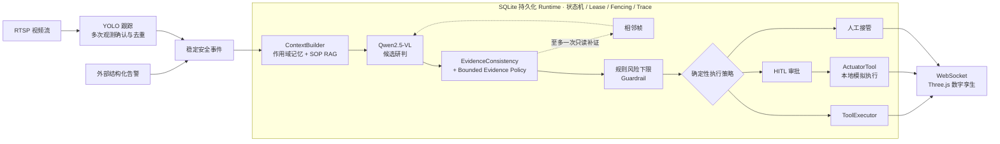

<h1 align="center">可信多模态工业安全 Agent Runtime</h1>

<p align="center">
  <strong>从稳定视觉事件到受控决策与可恢复执行</strong><br/>
  面向工业安全场景的 Qwen2.5-VL Agent 与 Three.js 数字孪生联动系统
</p>

<p align="center">
  <a href="https://github.com/33good/industrial-safety-agent-runtime/actions/workflows/ci.yml">
    
  </a>
</p>

<p align="center">
  <code>YOLO26</code> · <code>Qwen2.5-VL</code> · <code>SOP RAG</code> · <code>Guardrails</code> · <code>HITL</code> · <code>SQLite</code> · <code>Three.js</code>
</p>

---

系统先将持续视频流中的 YOLO 跟踪结果收敛为带来源、证据和业务身份的**稳定安全事件**，再由 Qwen2.5-VL 结合受控 Context 与 SOP 证据生成候选研判。风险下限与工具权限由确定性代码裁决，最终工具计划和执行路径由策略与 HITL 共同约束。

Run、事件快照、状态迁移与工具执行事实写入 SQLite，证据及审批/执行工件分目录持久化。入口幂等、状态机、Lease、Fencing Token 与工具结果复用支持故障后的安全收敛，闭环 Trace 负责重建和校验处置过程，最终状态同步到 Three.js 数字孪生界面。

## 可复核证据

| 验证范围 | 结果 | 证据 |
| --- | ---: | --- |
| 单元与本地集成测试 | **130 / 130** | [测试与评测说明](docs/evaluation.md) |
| Runtime 故障注入 | **6 / 6** | [故障恢复报告](benchmarks/reports/runtime_faults.md) |
| Trace 完整性与篡改反例 | **15 / 15** | [Trace 报告](benchmarks/reports/trace_integrity.md) |
| SOP 检索与无证据拒答 | **8 / 8** | [SOP 报告](benchmarks/reports/sop_retrieval.md) |
| `safety-v2.6` 固定 40 场景合成回放的最终工具计划合法率 | **40 / 40** | [多模态基线](benchmarks/reports/multimodal_latest.md) |

默认质量门禁还会运行 7 类确定性离线 Benchmark，且不依赖摄像头、GPU、Ollama 或真实工业设备。评测口径、版本指纹和逐例结果均保存在仓库内，详见 [评测与结果](docs/evaluation.md)。

## 系统架构



视觉帧是允许丢弃的高频数据，稳定事件才是 Agent Runtime 的业务输入。同一目标持续出现在画面中时，多次观测确认与冷却策略会抑制按视频帧频率重复触发。

## 核心设计

- **稳定事件入口**：目标关联、多次观测确认、冷却去重与入口幂等共同形成清晰的业务事件边界。
- **受控模型决策**：Qwen2.5-VL 负责候选研判；结构化校验、风险不可降级、工具白名单与 HITL 约束最终动作。
- **有依据的 Context**：按预算选择规则证据、作用域记忆和版本化 SOP，记录引用、裁剪原因与模型输入指纹。
- **可恢复的执行链**：入口/工具幂等与 Lease/Fencing Token 抑制重复执行和陈旧写入；成功步骤复用与三类进程级强杀边界测试验证换届、对账和人工接管的收敛语义，Trace 负责完整性校验。

## 快速验证

无需模型、摄像头或外部服务即可运行完整离线质量门禁：

```powershell
python -m pip install -r requirements-ci.txt
python -B verify.py
```

在已安装 Ollama 并准备好配置模型后，启动完整本地服务：

```powershell
.\setup.bat
.\start.bat
```

服务默认仅绑定本机地址，前端入口为 `http://127.0.0.1:18080`。关闭实时视觉时，无需私有 YOLO 权重即可通过 `/alarm` 验证 Agent 主链路；本地 Qwen、实时视觉与健康检查配置见 [启动与接入](docs/getting-started.md)。

## 深入了解

| 文档 | 内容 |
| --- | --- |
| [启动与接入](docs/getting-started.md) | 环境配置、YOLO26、服务启动、API 与事件闭环 |
| [Agent Runtime 设计](docs/agent-runtime.md) | Context、SOP RAG、补证、Guardrail、Trace 与故障恢复 |
| [评测与结果](docs/evaluation.md) | Benchmark 口径、运行命令、版本基线与报告索引 |
| [仓库边界](docs/repository_scope.md) | 可复现内容、运行数据与发布范围 |

## 部署与安全

- Runtime 主状态使用单机共享 SQLite 持久化，并支持同主机多进程 Worker 的 Lease、Heartbeat 与 Fencing Token。
- 执行联动默认使用本地模拟器；外部通知默认未配置，只有显式提供 Webhook 后才会发送。
- 模型权重、凭据、告警图片和运行数据库不会进入 Git。
- 第三方前端依赖与三维资产的来源及许可证见 [THIRD_PARTY_NOTICES.md](THIRD_PARTY_NOTICES.md)。
